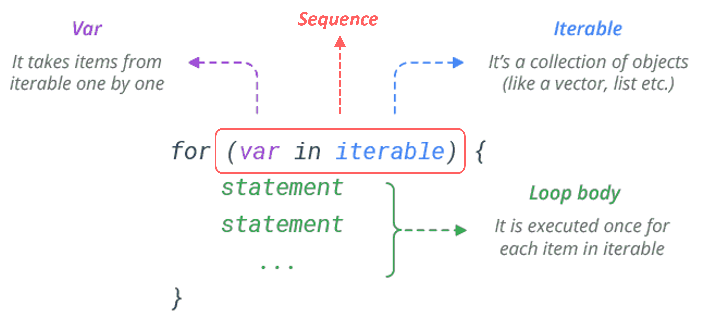

```{r, echo = F, message = F, warning = F}
# Load packages 
if(!require(pacman)) install.packages("pacman")
pacman::p_load(rlang, tidyverse, knitr, here, reactable, gt, flextable)

## functions
source(here::here("global/functions/misc_functions.R"))

## default render
registerS3method("reactable_5_rows", "data.frame", reactable_5_rows)
knitr::opts_chunk$set(class.source = "tgc-code-block", error = T)

```

# Introduction

At the heart of many programming tasks is the concept of repeating a task multiple times. A `for` loop in R allows us to do just that. Loops enable efficient repetition, saving time and effort.

Whether you're a beginner or an experienced coder, mastering these concepts is essential for writing intelligent R code.

Let's dive in and enhance your coding skills!

# Learning Objectives

By the end of this lesson, you will be able to:

-   Explain the syntax and structure of a basic `for` loop in R
-   Use index variables to iterate through multiple vectors simultaneously in a loop
-   Integrate `if/else` conditional statements within a loop
-   Store loop results in vectors and lists
-   Apply loops to tasks like analyzing multiple datasets and generating multiple plots
-   Debug loops by isolating and testing single iterations

## Packages

‣ We will use multiple packages in this lesson

‣ **Ensure the following packages are installed and loaded:**

```{r}
# Load necessary packages
if(!require(pacman)) install.packages("pacman")
pacman::p_load(tidyverse, here, openxlsx, tools, outbreaks, medicaldata)
```

## Intro to `for` Loops

‣ Let's start with a simple example of using `for` loops in R

‣ Suppose we have a **vector of children's ages** and want to **convert these to months**

‣ First, create a vector of ages in years

```{r}
ages <- c(7, 8, 9)                        # ages 7 8 and 9
```

‣ We could easily convert ages to months using `*` operation in R

```{r}
ages * 12
```

‣ What R is doing (conceptually) though is running a for loop. Let's write it out explicitly

```{r}
for (age in ages) print(age * 12)
```

‣ `age` is a temporary variable that takes each element in `ages`

‣ You can choose **any name** for this variable

```{r}
for (random_name in ages) print(random_name * 12)  # random_name
```

‣ If the loop's content is **more than one line**, use **curly brackets** `{}`

```{r}
for (age in ages) {   # multiple line loop 
  age_months <- age * 12
  print(age_months)
} 
```

‣ The general structure of any `for` loop:

{width="420"}

::: practice

*(NOTE: Answers are at the bottom of the page. Try to answer the questions yourself before checking.)*

### Hours to Minutes Basic Loop {.unlisted .unnumbered}

Try converting hours to minutes using a `for` loop. Start with this vector of hours:

```{r eval = F}
hours <- c(3, 4, 5) # Vector of hours
# Your code here

for (hour in hours) {
  minutes <- hour * 60 
  print(minutes) # convert hours to minutes and print(minutes)
}
```
:::

‣ Side-note: Loops can be nested within each other. For instance:

```{r}
# for i in 1:2, for j in 1:2, print i * j
for (i in 1:2) {
  for (j in 1:2) {
    print(i * j)
  }
}
```

‣ This creates a combination of `i` and `j` values as shown in this table:

| i   | j   | i \* j |
|-----|-----|--------|
| 1   | 1   | 1      |
| 1   | 2   | 2      |
| 2   | 1   | 2      |
| 2   | 2   | 4      |

‣ Nested loops are less common though, and often have more efficient alternatives.

:::

# Are `for` Loops Useful in R?

‣ R already has *vectorized* operations!

‣ Example: Age conversion without a loop. (Does not work by default in most programming languages)

```{r}
# ages * 12
ages * 12

```

‣ Moreover, usually working with data frames and `tidyverse` operations:

```{r}
ages_df <- tibble(age = ages)
# mutate ages_df to add age_months column
ages_df %>% 
  mutate(age_months = age * 12)
```

‣ Loops will be quite useful in specific scenarios:

-   operations on multiple data frames
-   working with non-dataframe objects (e.g. plots)

‣ We'll see this later in the lesson. For now, will focus on simple, "toy" examples.

‣ **Loops vs function mapping?**

‣ Often, loop tasks can be replaced with custom functions which are then mapped across a vector or data frame.

‣ But loops are easy to learn, think about and debug, even for beginners.

## Looping with an Index

‣ Often useful to loop through a vector using an index, which is a counter for the current iteration.

‣ Example: converting ages in years to months using an index:

```{r}
# Recall:
ages <- c(7, 8, 9) # Vector of ages
```

‣ Create a sequence of indices the same length as the ages vector:

```{r}
1:length(ages) # 1 to the length of ages
indices <- 1:length(ages) # then assign to object called indices
```

‣ Use the index in a `for` loop to convert each age to months:

```{r}
# for i in indices, print ages[i] * 12
for (i in indices) print(ages[i] * 12)
```

‣ The variable name in the loop (e.g., `i`, `j`, `index`) is arbitrary.

‣ Of course, index-based loops can be used directly without a separate variable:

```{r}
# for i in 1:length(ages), print ages[i] * 12
for (i in 1:length(ages)) print(ages[i] * 12)
```

‣ Such indexed loops will be helpful for working with multiple vectors simultaneously.

::: practice
### Hours to Minutes Indexed Loop {.unlisted .unnumbered}

Rewrite your loop from last question using indices:

```{r, eval = F}
hours <- c(3, 4, 5) # Vector of hours

# Your code here

for (i in 1:length(hours)) {
  print(hours[i] * 60)
}
```
:::

‣ Side-note: The function `seq_along()` is a shortcut for creating a sequence of indices.

‣ Equivalent to `1:length()`:

```{r}
# These two are equivalent ways to generate sequence of indices for `ages`
1:length(ages)
seq_along(ages)
```

# Looping on Multiple Vectors

‣ Looping with indices allows us to work with multiple vectors simultaneously.

```{r}
# Consider:
ages <- c(7, 8, 9) # ages in years
heights <- c(120, 130, 140) # heights in cm
```

‣ We can loop through both using the index method:

```{r}
# for i in 1:length(ages), print a pasted string with age and height

for(i in 1:length(ages)) {
  age <- ages[i]
  height <- heights[i]
  print(paste("Age:", age, "Height:", height))
}
```

‣ In each iteration:

-   `i` is the index.
-   We extract the ith element from each vector
-   We paste the two together
-   We print the result

Alternatively, we can skip the variable assignment and use the indices in the `print()` statement directly:

```{r}
for(i in 1:length(ages)) {
  print(paste("Age:", ages[i], "Height:", heights[i]))
}
```

::: practice
### BMI Calculation Loop {.unlisted .unnumbered}

Using a for loop, calculate the Body Mass Index (BMI) of the three individuals shown below. The formul for BMI is `BMI = weight / (height ^ 2)`.

```{r eval = F}
weights <- c(30, 32, 35) # Weights in kg
heights <- c(1.2, 1.3, 1.4) # Heights in meters

for(i in 1:length(weights)) {
  weight <- weights[i]
  height <- heights[i]
  bmi <- weight/(height^2)
  print(paste("Weight:", weight,
              "Height:", height,
              "BMI:", bmi
  ))
  }

```

:::

## Storing Loop Results

‣ Usually we want to store loop results rather than just printing.

‣ Example: converting ages to months.

```{r}
# Recall this loop:
ages <- c(7, 8, 9) # Vector of ages
for(i in 1:length(ages)) {
  print(ages[i] * 12)
}
```

‣ Let's try to store this info in a vector.

‣ Create an empty vector to store results.

```{r}
ages_months <- vector(mode = "numeric", length = length(ages)) # vector of mode "numeric" and length 3

ages_months
```

‣ How do we store values in this vector?

```{r}
ages_months[1] <- 99                     # Store 99 in the first element of ages_months
ages_months[2] <- 100                      # Store 100 in the second element of ages_months

ages_months
```

‣ Now, let's execute the loop, storing the results in `ages_months`:

```{r}
 ages_months <-  vector("numeric", length(ages))             # Create `age_months` vector of mode "numeric" and length of ages

for (i in 1:length(ages)){
  ages_months[i] <- ages[i] * 12
}              # for i in 1:length(ages)
              # store ages[i] * 12 in ages_months[i]
ages_months
```

::: practice
### Height cm to m {.unlisted .unnumbered}

Use a for loop to convert height measurements from cm to m. Store the results in a vector called `height_meters`.

```{r eval = F}
height_cm <- c(180, 170, 190, 160, 150) # Heights in cm 

height_m <- vector("numeric", length(height_cm)) # numeric vector of same length as height_cm

for (i in 1:length(height_cm)) {
  height_m[i] <- height_cm[i]/100
}

height_m
```
:::

‣ Watch out! Create your empty object **outside** the loop to save all iteration results.

```{r}
# Consider this:
ages <- c(7, 8, 9)

for (i in 1:length(ages)) {
  ages_months <- vector("numeric", length(ages))
  ages_months[i] <- ages[i] * 12
}
ages_months 
```

‣ Do you see the problem?

‣ Side Note. In a rush? Initialize your vector with `c()` and append values:

```{r}
ages <- c(7, 8, 9)
ages_months <- c() # quick and dirty way to initialize vector

for (i in 1:length(ages)) {
  ages_months[i] <- ages[i] * 12
}
ages_months
```

‣ And, you can append values at the end of the vector using `c()`:

```{r}
# Redo loop, but append values to end of vector with c()
ages <- c(7, 8, 9)
ages_months <- c() # quick and dirty way to initialize vector

for (i in 1:length(ages)) {
  ages_months <- c(ages_months, ages[i]*12)
}
ages_months

number <- 9
number
number <- c(number, 10)
number
```

‣ Discouraged because R does not know the final length of the vector, so reallocates memory each time you append a value.

‣ Slow performance with large vectors. But for quick analysis, it's fine.

# If Statements in Loops

‣ `If` statements can be integrated into loops in R.

‣ Example: Classifying ages as "Child" if under 18.

```{r}
age_vec <- c(2, 12, 17, 24, 60) # Vector of ages

# for age in ages, if age < 18, print "Child"
for (age in age_vec){
  if (age < 18) {
    print("Child")
  }
}
```

‣ Use curly braces for clarity and adding more code.

```{r}
age_vec <- c(2, 12, 17, 24, 60) # Vector of ages

# for age in ages, if age < 18, print "Child"
for (age in age_vec){
  if (age < 18) {
    print("Processing:") # put these in loop:
    print(paste("Child, Age", age ))
  }
}
```

‣ Let's add another condition with `else if` as 'Child' or 'Teen' based on age.

```{r}
# Add else if age >= 13 && age < 18, print "Teen"
for (age in age_vec) {
  if (age < 13) {
    print(paste("Child, Age", age))
  } else if (age >= 13 && age < 18){
      print(paste("Teen, Age", age))
    }
}
```

‣ Final `else` statement for other ages, classifying as 'Adult'.

```{r}
# Add final else statement for "Adult"
for (age in age_vec) {
  if (age < 13) {
    print(paste("Child, Age", age))
  } else if (age >= 13 && age < 18){
      print(paste("Teen, Age", age))
  } else {
      print(paste("Adult, Age", age))
    }
} 
```

‣ We can store these classifications in a vector using index-based loop.

```{r}
age_class <- vector("character", length(age_vec))  # vector of mode "character" and length of age_vec
  
# Refactor loop from above to store classifications in age_class
for (i in 1:length(age_vec)) {
  if (age_vec[i] < 13) {
    age_class[i] <- paste("Child, Age", age_vec[i])
  } else if (age_vec[i] >= 13 && age_vec[i] < 18){
     age_class[i] <- paste("Teen, Age", age_vec[i])
  } else {
      age_class[i] <- paste("Adult, Age", age_vec[i])
    }
}

age_class
```


::: practice
### Temperature Classification {.unlisted .unnumbered}

You have a vector of body temperatures in Celsius. Classify each temperature as 'Hypothermia', 'Normal', or 'Fever' using a `for` loop combined with `if` and `else` statements.

Use these rules:

-   Below 36.0°C: 'Hypothermia'
-   Between 36.0°C and 37.5°C: 'Normal'
-   Above 37.5°C: 'Fever'

```{r eval = F}
body_temps <- c(35, 36.5, 37, 38, 39.5) # Body temperatures in Celsius
classif_vec <- vector("character", length(body_temps)) # character vec, length of body_temps

for (i in 1:length(body_temps)) {
    # Add your if-else logic here
    if (body_temps[i] < 36.0) {
        classif_vec[i] <- paste(body_temps[i], "°C is Hypothermia")
    } 
  else if (body_temps[i] >= 36.5 && body_temps[i] <= 37.5 ) {
    classif_vec[i] <- paste(body_temps[i], "°C is Normal")
  }
  else {
    classif_vec[i] <- paste(body_temps[i], "°C is Fever")
  }
    ## add other conditions and their corresponding classifications
}

classif_vec
```

An expected output is below

```         
35°C is Hypothermia
36.5°C is Normal
37°C is Normal
38°C is Fever
39.5°C is Fever
```
:::

# Real Loops Application: Generating Multiple Plots

‣ Using loops to **generate multiple plots** for different groups within a dataset.

‣ Example with the `strep_tb` dataset from `medicaldata` package.

‣ Aim: create **category inspection plots** for each **radiologic 6-month improvement group** using `inspectdf::inspect_cat()`.

‣ First, create a **single plot** for the **first radiologic improvement group**.

```{r}
cat_plot <- 
  medicaldata::strep_tb %>%
  filter(radiologic_6m == "6_considerable_improvement") %>% 
  inspectdf::inspect_cat() %>% 
  inspectdf::show_plot()
                           # filter radiologic_6m to "6_Considerable_improvement"
                           # inspect_cat
                           # show_plot
```

‣ Want to create similar plots for **each radiologic improvement group**.

‣ Identify all unique values of `medicaldata::strep_tb$radiologic_6m`

```{r}
radiologic_levels_6m <- unique(medicaldata::strep_tb$radiologic_6m)
```

‣ Initiate an **empty list object** to store the plots.

```{r}
cat_plot_list <- vector("list", length(radiologic_levels_6m))
```

‣ Optionally, set names of list elements to the radiologic improvement groups.

```{r}
names(cat_plot_list) <- radiologic_levels_6m

cat_plot_list
```

‣ Let's put it together

```{r}
cat_plot_list <- vector("list", length(radiologic_levels_6m))

for (level in radiologic_levels_6m) {
  
  # Generate plot for each level
 cat_plot <- 
    medicaldata::strep_tb %>% 
    filter(radiologic_6m == level) %>% 
    inspectdf::inspect_cat() %>%
    inspectdf::show_plot()
  
  # Append to the list
  cat_plot_list[[level]] <- cat_plot
}
```

‣ Access a specific plot using **double bracket syntax** or by number.

```{r}
cat_plot_list[["6_Considerable_improvement"]] # "6_Considerable_improvement"

cat_plot_list[["5_Moderate_improvement"]]
```

```{r}
cat_plot_list[[1]]
```

‣ To display all plots at once, call the entire list.

```{r fig.height = 2, fig.show='hold', message=F}
cat_plot_list
```

::: practice 
### Visualizing TB Cases {.unlisted .unnumbered}

In this exercise, you will use WHO data from the `tidyr` package to create line graphs showing the number of new TB cases in children over the years in South American countries.

First, we'll prepare the data:

```{r}
tb_child_cases <- tidyr::who2 %>% 
  transmute(country, year, 
            tb_cases_children = sp_m_014 + sp_f_014 + sn_m_014 + sn_f_014) %>% 
  filter(country %in% c("Brazil", "Colombia", "Argentina", 
                        "Uruguay", "Chile", "Guyana"))  %>% 
  filter(year >= 2006)

tb_child_cases
```

Now, fill in the blanks in the template below to create a line graph for each country using a `for` loop:

```{r}
# Get list of countries. Hint: Use unique() on the country column
countries <- unique(tb_child_cases$country)
# Create list to store plots. Hint: Initialize an empty list
tb_child_cases_plots <- vector("list", length(countries))

names(tb_child_cases_plots) <- countries # Set names of list elements

# Loop through countries
for (name in countries) { 
  
  # Filter data for each country
  tb_child_cases_filtered <-  filter(tb_child_cases, country == name)
  
  # Make plot
  tb_child_cases_plot <- ggplot(tb_child_cases_filtered, aes(x = year, y = tb_cases_children)) +
    geom_line() +
    ggtitle(paste("TB Cases in Children -", name)) 
    
  
  # Append to list. Hint: Use double brackets
  tb_child_cases_plots[[name]] <- tb_child_cases_plot 
}

tb_child_cases_plots
```
:::

# Wrap Up!

In this lesson, we delved into for loops in R, demonstrating their utility from basic tasks to complex data analysis involving multiple datasets and plot generation. Despite R's preference for vectorized operations, for loops are indispensable in certain scenarios. Hopefully, this lesson has equipped you with the skills to confidently implement for loops in various data processing contexts.

# Answer Key

### Hours to Minutes Basic Loop

```{r}
hours <- c(3, 4, 5) # Vector of hours

for (hour in hours) {
  minutes <- hour * 60
  print(minutes)
}
```

### Hours to Minutes Indexed Loop

```{r}
hours <- c(3, 4, 5) # Vector of hours

for (i in 1:length(hours)) {
  minutes <- hours[i] * 60
  print(minutes)
}
```

### BMI Calculation Loop

```{r}
weights <- c(30, 32, 35) # Weights in kg
heights <- c(1.2, 1.3, 1.4) # Heights in meters

for(i in 1:length(weights)) {
  bmi <- weights[i] / (heights[i] ^ 2)
  
  print(paste("Weight:", weights[i],
              "Height:", heights[i],
              "BMI:", bmi))
}
```

### Height cm to m

```{r}
height_cm <- c(180, 170, 190, 160, 150) # Heights in cm 

height_m <- vector("numeric", length = length(height_cm)) 

for (i in 1:length(height_cm)) {
  height_m[i] <- height_cm[i] / 100
}
height_m
```

### Temperature Classification

```{r}
body_temps <- c(35, 36.5, 37, 38, 39.5) # Body temperatures in Celsius
classif_vec <- vector(mode = "character", length = length(body_temps))

for (i in 1:length(body_temps)) {
    if (body_temps[i] < 36.0) {
        classif_vec[i] <- paste(body_temps[i], "°C is Hypothermia")
    } else if (body_temps[i] <= 37.5) {
        classif_vec[i] <- paste(body_temps[i], "°C is Normal")
    } else {
        classif_vec[i] <- paste(body_temps[i], "°C is Fever")
    }
}

classif_vec
```

### Visualizing TB Cases

```{r}
# Assuming tb_child_cases is a dataframe with the necessary columns
countries <- unique(tb_child_cases$country)

# Create list to store plots
tb_child_cases_plots <- vector("list", length(countries))
names(tb_child_cases_plots) <- countries

# Loop through countries
for (countryname in countries) { 
  
  # Filter data for each country
  tb_child_cases_filtered <- filter(tb_child_cases, country == countryname)
  
  # Make plot
  tb_child_cases_plot <- ggplot(tb_child_cases_filtered, aes(x = year, y = tb_cases_children)) +
    geom_line() +
    ggtitle(paste("TB Cases in Children -", countryname))
  
  # Append to list
  tb_child_cases_plots[[countryname]] <- tb_child_cases_plot 
}

tb_child_cases_plots[["Uruguay"]]
```

# Contributors {.unlisted .unnumbered}

The following team members contributed to this lesson:

`r tgc_contributors_list(ids = c("sabina", "kendavidn"))`

------------------------------------------------------------------------

# References {.unnumbered .unlisted}

Some material in this lesson was adapted from the following sources:

-   Barnier, Julien. "Introduction à R et au tidyverse." <https://juba.github.io/tidyverse>

-   Wickham, Hadley; Grolemund, Garrett. "R for Data Science." <https://r4ds.had.co.nz/>

-   Wickham, Hadley; Grolemund, Garrett. "R for Data Science (2e)." <https://r4ds.hadley.nz/>

